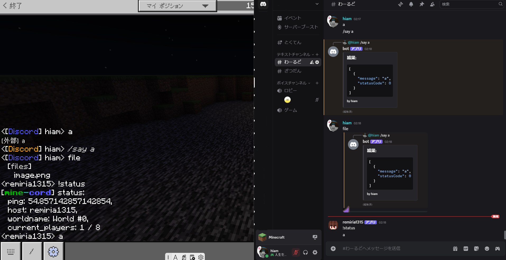

# mine-cord
[JA](README.mc) / EN  
I got so bored that I made a chat integration.

I didn’t bother making a config.json.  
There are settings around line 62!

Here’s how it looks! ↓  

## How to set it up!
1. Download the zip from the green "Code" button!  
2. Extract it!  
3. Run `npm i`!  
4. Run `node index.js`!

Where should I report bugs...? Someone please tell meーー
